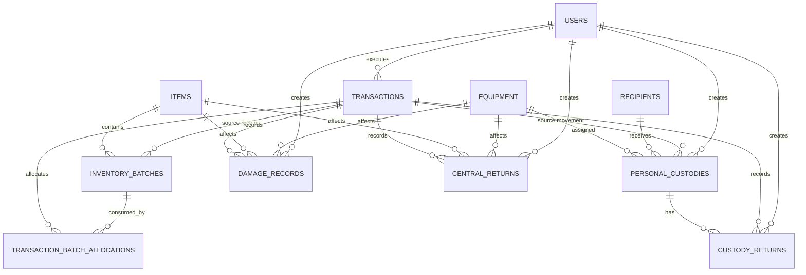

# خطة تطوير نظام مستودع الإسعاف والطوارئ — دمشق

**الإصدار:** 1.0  
**التاريخ:** 2026-08-13  
**الحالة:** المراحل 1 و2 و3 و4 و5 منفذة ومختبرة — المراحل 6–9 لم يبدأ تنفيذها
**نطاق الوثيقة:** تحويل المتطلبات الوظيفية المرفقة إلى مراحل تنفيذ واختبار وتوثيق قابلة للقياس.

---

## 1. الملخص التنفيذي

تهدف هذه الخطة إلى تطوير نظام مستودع الإسعاف والطوارئ ليعكس دورة حياة المواد
والتجهيزات بدقة، مع الفصل الواضح بين:

1. المواد المستهلكة التي ينقص رصيدها عند الإخراج.
2. التجهيزات والثوابت التي تنتقل إلى عهدة شخصية دون أن ينقص رصيدها التشغيلي
   بمجرد التسليم.
3. حالات التلف وإعادة العهدة الشخصية والمرتجع إلى المستودع المركزي، وهي
   عمليات مستقلة يجب أن تكون قابلة للتتبع والتدقيق.

الهدف ليس إضافة حقول إلى الواجهة فقط، بل بناء سجل حركات موحد وقابل للتدقيق
يضمن أن كل عملية إدخال أو إخراج أو تلف أو إرجاع:

- مرتبطة بمستند وتاريخ وجهة وموظف منفذ.
- تنفذ ذريًا داخل معاملة قاعدة بيانات واحدة.
- تؤثر على الرصيد الصحيح فقط.
- تظهر في سجل تاريخي مرتب من الأقدم إلى الأحدث.
- قابلة للطباعة والمراجعة والتصدير.

> **مبدأ حاكم:** لا يتم تعديل الرصيد مباشرة من صفحات الواجهة. كل تغيير يمر من
> خدمة حركات مركزية تتحقق من النوع والكمية والصلاحيات وتكتب سجل التدقيق.

---

## 2. نتيجة دراسة الوضع الحالي

### 2.1 البنية الحالية ذات الصلة

المشروع عبارة عن monorepo باستخدام React/Vite وExpress وDrizzle/PostgreSQL.
المسارات والملفات الأهم في التنفيذ المستقبلي:

| المجال | الملفات الحالية |
|---|---|
| مخطط قاعدة البيانات | `lib/db/src/schema/items.ts`، `equipment.ts`، `transactions.ts` |
| مسارات الحركة | `artifacts/api-server/src/routes/transactions.ts` |
| نموذج الإدخال | `artifacts/web/src/pages/transaction-in-form.tsx` |
| نموذج الإخراج | `artifacts/web/src/pages/transaction-out-form.tsx` |
| صفحة المواد | `artifacts/web/src/pages/items.tsx` |
| صفحات الحركات | `artifacts/web/src/pages/transactions.tsx`، `print-transaction.tsx` |
| تعريف المسارات | `artifacts/web/src/App.tsx`، `artifacts/api-server/src/routes/index.ts` |
| عقد API والتوليد | `lib/api-spec/openapi.yaml`، `lib/api-client-react`، `lib/api-zod` |

### 2.2 الفجوات المؤكدة

- جدول `transactions` يدعم حاليًا `in/out/init/adjust` فقط، ولا يملك نوعًا
  مستقلًا للتلف أو إعادة العهدة أو المرتجع المركزي.
- نموذج الإدخال يحتوي على مورد حر اختياري، ولا يفرض أن المورد هو المستودعات
  المركزية أو يسجل رقم وتاريخ مذكرة التسليم.
- نموذج الإخراج يستخدم جهة مستلمة وسبب إخراج عامين، ولا يفرق بين إخراج
  مستهلكات وإخراج عهدة شخصية.
- إخراج المادة المستهلكة ينقص `items.currentStock`، بينما إخراج التجهيز الحالي
  يغير حالته إلى `consumed`؛ وهذا لا يحقق مفهوم العهدة الشخصية.
- `items` يملك `expiryDate` واحدًا على مستوى المادة. هذا لا يكفي وحده لتطبيق
  FEFO بشكل صحيح عند وجود دفعات متعددة بصلاحيات مختلفة.
- لا توجد جداول مستقلة لسجل العهدة الشخصية أو التلف أو المرتجع المركزي.
- لا يوجد مسار ظاهر لتفاصيل المادة يعرض سجلًا تاريخيًا شاملًا.
- توليد أرقام المستندات يعتمد على العدّ، ويحتاج إلى معالجة التزامن حتى لا
  يتكرر الرقم عند عمليتين متزامنتين.
- الاختبارات الآلية الوظيفية والتكاملية وE2E غير موجودة حاليًا كمنظومة مكتملة.

---

## 3. قرارات العمل التي يجب تثبيتها قبل البرمجة

هذه النقاط يجب اعتمادها كتابيًا من مسؤول المستودعات قبل بدء مرحلة المخطط؛
وذلك لمنع بناء سلوك محاسبي غير مقصود:

### 3.1 تعريف الرصيد للتجهيزات والثوابت

يقترح اعتماد أرصدة منفصلة بدل رقم واحد غامض:

- **الرصيد الكلي:** ما هو مسجل في المستودع.
- **المتاح في المستودع:** ما يمكن تسليمه حاليًا.
- **قيد العهدة الشخصية:** ما تم تسليمه ولم يُعد.
- **التالف:** ما خرج من الخدمة بسبب تلف مثبت.
- **المرتجع المركزي:** حركة توثق إعادة الصنف إلى المستودع المركزي.

يجب اعتماد القاعدة الدقيقة للمرتجع المركزي:

- هل تعود الكمية إلى المتاح في مستودع دمشق؟
- أم تسجل كخروج نهائي من عهدة مستودع دمشق؟

ستبقى هذه النقطة **قرار قبول مطلوبًا** قبل تنفيذ منطق الرصيد.

### 3.2 نطاق العهدة الشخصية

خيار **عهدة شخصية** يظهر فقط عند اختيار:

- التجهيزات.
- الثوابت أو الأصول التي ستصنف ضمن نوع غير مستهلك.

ولا يظهر عند اختيار المواد المستهلكة. إذا كان النظام الحالي يستخدم نوع
`equipment` لتمثيل التجهيزات والثوابت معًا، يجب تثبيت طريقة التمييز:
نوع تصنيف مستقل، أو خاصية واضحة على الصنف، أو قاموس أنواع معتمد.

### 3.3 الصلاحية والدفعات

للتمكن من الصرف حسب تاريخ الصلاحية الأقرب عند تعدد الدفعات، يجب اعتماد
سجل دفعات مستقل يحتوي على الأقل:

- المادة.
- رقم الدفعة إن وجد.
- الكمية الواردة.
- الكمية المتبقية.
- تاريخ الصلاحية الاختياري.
- رقم وتاريخ مذكرة التسليم.

وجود `expiryDate` واحد في جدول المادة لا يكفي لتطبيق هذا الشرط بأمان.

### 3.4 القيم المقيدة

يجب اعتماد القوائم التالية كقيم نظامية لا كنصوص حرة:

- جهة التوريد: **المستودعات المركزية** فقط.
- جهة التسليم للمستهلكات: **مبانٍ إدارية** أو **نقاط إسعاف**.
- اسم المستلم: قائمة اختيار قابلة للإدارة، مع منع النص الحر إلا بصلاحية
  محددة عند الحاجة.
- نوع الحركة: إدخال، إخراج مستهلكات، تسليم عهدة، إعادة عهدة، تلف، مرتجع
  مركزي، تسوية افتتاحية/إدارية.

---

## 4. مبادئ التنفيذ والضبط

1. تحديث `lib/api-spec/openapi.yaml` أولًا، ثم إعادة توليد العميل ومخططات Zod؛
   يمنع تعديل الملفات المولدة يدويًا.
2. تنفيذ قواعد العمل في الخادم، ثم تكرار التحقق في الواجهة لتحسين تجربة
   المستخدم، وليس الاعتماد على الواجهة وحدها.
3. تنفيذ إنشاء الحركة وتعديل الرصيد وربط الدفعات وسجل التدقيق داخل معاملة
   PostgreSQL واحدة.
4. منع الرصيد السالب وقبول كمية صفرية أو سالبة أو صنف غير من النوع الصحيح.
5. حفظ لقطات المستندات والجهات والأسماء داخل الحركة حتى لا يتغير التاريخ عند
   تعديل الاسم لاحقًا.
6. عدم حذف الحركات المالية/المستودعية حذفًا فعليًا؛ التصحيح يتم بحركة عكسية
   موثقة وبصلاحية مناسبة.
7. استخدام تاريخ محلي واضح للمستندات مع تخزين timestamps في PostgreSQL، وتوثيق
   المنطقة الزمنية المعتمدة.
8. جعل أرقام المستندات فريدة وآمنة عند التزامن باستخدام تسلسل أو آلية قفل
   مناسبة بدل الاعتماد على `count`.
9. الحفاظ على RTL والطباعة A4 وتوافق الجوال، مع رسائل تحقق عربية واضحة.
10. أخذ نسخة احتياطية قبل أي ترحيل بيانات أو تغيير في المخطط.

---

## 5. المراحل التنفيذية

## المرحلة 0 — تثبيت المتطلبات وخط الأساس

### الهدف

تحويل الطلب إلى قاموس بيانات ومصفوفة قبول معتمدة قبل تغيير قاعدة البيانات.

### الأعمال

- اعتماد تعريف المستهلكات والتجهيزات والثوابت والعهدة الشخصية.
- اعتماد سلوك رصيد التجهيز عند التسليم والتلف والإعادة والمرتجع المركزي.
- اعتماد أسماء الحقول العربية والإنجليزية والقيم المقيدة.
- جرد البيانات الحالية والحركات الموجودة والحقول التي لا يمكن استعادتها
  تاريخيًا.
- تحديد صلاحيات كل دور: مدير، أمين مستودع، مراقب/مشاهد.
- إعداد نسخة اختبار منفصلة ونسخة احتياطية من بيانات التطوير.
- إعداد مصفوفة تتبع: كل مطلب ← API ← صفحة ← اختبار ← دليل قبول.

### الاختبار

- مراجعة المتطلبات مع مسؤول المستودعات وتسجيل الموافقة.
- تجربة سيناريوهات مكتوبة على الورق للآتي:
  - إدخال مستهلكات من المستودع المركزي.
  - إخراج مستهلكات إلى مبنى إداري.
  - تسليم تجهيز كعهدة شخصية.
  - إعادة عهدة شخصية.
  - تسجيل تلف.
  - مرتجع إلى المستودع المركزي.
- التأكد من عدم وجود تعارض في معنى كلمة “الرصيد”.

### التوثيق والمخرج

- `docs/requirements.md`: المتطلبات المعتمدة وقاموس المصطلحات.
- `docs/acceptance-matrix.md`: مصفوفة المتطلبات والاختبارات.
- تقرير خط أساس يضم نسخة Node/pnpm، نتيجة `typecheck` و`build`، وحالة قاعدة
  البيانات الحالية.

### بوابة الانتقال

لا تبدأ مرحلة المخطط قبل اعتماد تعريف الرصيد، خاصة سلوك المرتجع المركزي
وسلوك الصنف المسلّم للعهدة الشخصية.

---

## المرحلة 1 — تصميم البيانات والترحيل الآمن

### الهدف

إضافة بنية بيانات تحفظ المستندات والدفعات والعهدة والتلف والمرتجعات بدون
كسر البيانات الحالية.

### التصميم المقترح

1. توسيع حركة الإدخال لتشمل:
   - رقم مذكرة التسليم من المستودع المركزي.
   - تاريخ مذكرة التسليم.
   - جهة التوريد بقيمة نظامية ثابتة.
   - تاريخ الصلاحية الاختياري.
   - رقم الدفعة عند توفره.
2. إنشاء كيان دفعات/أرصدة فرعية للمستهلكات يدعم عدة دفعات للمادة نفسها.
3. إضافة بيانات الإخراج الخاصة بالمستهلكات:
   - رقم مذكرة التسليم الداخلية.
   - تاريخها.
   - جهة التسليم.
   - اسم المستلم.
   - الكمية.
   - الدفعات التي صُرفت فعليًا وتاريخ صلاحيتها.
4. إضافة بيانات العهدة الشخصية:
   - المستلم.
   - رقم مذكرة تسليم العهدة.
   - تاريخ التسليم.
   - الكمية.
   - المكان.
   - حالة العهدة الحالية.
5. إضافة أنواع/كيانات مستقلة للتلف، إعادة العهدة الشخصية، والمرتجع المركزي،
   مع رقم مستند وسبب وتاريخ ومنفذ الحركة.
6. إضافة جدول تخصيص الدفعات للحركات الخارجة؛ لضمان أن FEFO قابل للمراجعة.
7. إضافة قيود وفهارس على المفاتيح والتواريخ وأرقام المستندات.

### ملفات التنفيذ المتوقعة

- `lib/db/src/schema/transactions.ts`
- `lib/db/src/schema/items.ts`
- `lib/db/src/schema/equipment.ts`
- ملفات schema جديدة للدفعات والعهد والتلف والمرتجعات.
- `lib/db/src/schema/index.ts`
- `lib/db/drizzle.config.ts` وملفات migrations إن تم اعتمادها.

### الاختبار

- اختبار ترحيل على نسخة قاعدة بيانات منسوخة، لا على بيانات الإنتاج.
- التأكد من أن البيانات القديمة تقرأ دون فقدان.
- اختبار التراجع عن migration أو استعادة النسخة الاحتياطية.
- اختبار القيود:
  - رقم مستند مكرر.
  - تاريخ غير صالح.
  - كمية سالبة.
  - كمية عهدة أكبر من المتاح.
  - جهة توريد غير المستودعات المركزية.
- اختبار تعدد الدفعات مع صلاحيات مختلفة.

### التوثيق والمخرج

- مخطط ERD محدث.
- قاموس حقول يوضح الإلزامي والاختياري ومصدر كل قيمة.
- خطة migration/backfill للحركات القديمة مع وسمها كـ“بيانات تاريخية غير
  مكتملة” عندما لا يتوفر رقم المذكرة أو تاريخها.
- سجل قرار يوضح سلوك الرصيد للتجهيز والمرتجع.

### بوابة الانتقال

لا تُقبل المرحلة إذا أمكن إنشاء حركة لا يمكن تفسير أثرها على الرصيد أو
لا يمكن ربطها بمستند ومستخدم وتاريخ.

---

## المرحلة 2 — إعادة بناء خدمة الحركات وقواعد الرصيد

### الهدف

جعل الإدخال والإخراج والتلف والإرجاع عمليات ذرية وآمنة ومتماسكة.

### الأعمال

- إنشاء خدمة مركزية للحركات بدل تكرار تحديث الرصيد داخل route منفصل.
- التحقق من تطابق `itemType` مع `itemId/equipmentId`.
- قفل السجلات المناسبة أثناء الخصم لمنع السباق بين عمليتي إخراج متزامنتين.
- تطبيق FEFO للمستهلكات:
  - ترتيب الدفعات حسب تاريخ الصلاحية تصاعديًا.
  - وضع الدفعات بلا صلاحية في آخر الترتيب.
  - رفض العملية إذا لم يكف الرصيد.
  - حفظ كمية الصرف من كل دفعة.
- تطبيق قواعد التجهيزات والثوابت:
  - التسليم للعهدة لا يخفض الرصيد المتاح بالطريقة المطبقة على المستهلكات؛
    بل يزيد كمية العهدة ويغير حالة التخصيص.
  - التلف يسجل حركة تلف ويخفض المتاح وفق القرار المعتمد.
  - إعادة العهدة تغلق العهدة وتعيد/تخفض المتاح بحسب الحالة والقرار المعتمد.
  - المرتجع المركزي يسجل كحركة مستقلة ولا يخلط مع إعادة العهدة.
- توليد أرقام مستندات آمنة ومميزة.
- كتابة audit log لكل نجاح وفشل حساس، مع منع إخفاء أخطاء التسجيل.

### الاختبار

- اختبار وحدة لحساب FEFO مع:
  - دفعتين بصلاحيتين مختلفتين.
  - ثلاث دفعات وحالة استهلاك جزئي.
  - دفعة منتهية الصلاحية.
  - دفعة بلا صلاحية.
- اختبار معاملة كاملة: إذا فشل سجل الحركة لا يتغير الرصيد.
- اختبار عمليتين متزامنتين على الرصيد نفسه.
- اختبار رصيد التجهيز بعد التسليم والتلف والإعادة والمرتجع.
- اختبار عدم تكرار رقم المستند عند 20 عملية متزامنة.
- اختبار صلاحيات الأدوار ومنع تنفيذ الحركات خارج الدور.

### التوثيق والمخرج

- توثيق قواعد الرصيد في `docs/inventory-rules.md`.
- توثيق أمثلة قبل/بعد لكل نوع حركة.
- توثيق أكواد الأخطاء ورسائل المستخدم العربية.
- توثيق استراتيجية التزامن والـtransactions.

### بوابة الانتقال

يجب أن تتطابق أرصدة التقارير مع مجموع الحركات في كل fixture، دون فروقات
غير مفسرة.

---

## المرحلة 3 — تطوير الإدخال من المستودع المركزي

### الهدف

جعل الإدخال موثقًا بمذكرة تسليم مركزية وقابلًا لإنشاء دفعات الصلاحية.

### تجربة المستخدم

في `transaction-in-form.tsx`:

- تثبيت جهة التوريد على “المستودعات المركزية” وعدم عرض مورد حر.
- إضافة رقم مذكرة التسليم.
- إضافة تاريخ مذكرة التسليم.
- إضافة تاريخ الصلاحية بشكل اختياري.
- إضافة رقم الدفعة عند الحاجة.
- التمييز بصريًا بين الحقول الإلزامية والاختيارية.
- إظهار ملخص الدفعة والكمية التي ستضاف.
- منع التأكيد قبل صحة المستند والتاريخ والكمية.

### API والعقد

- تحديث عقد POST للإدخال في `lib/api-spec/openapi.yaml`.
- إعادة توليد `lib/api-client-react` و`lib/api-zod`.
- إضافة تحقق خادمي من أن جهة التوريد مركزية.
- حفظ الحقول في الحركة والدفعة، لا في الواجهة فقط.

### الاختبار

- إدخال مستهلكة بمذكرة صحيحة وصلاحية صحيحة.
- إدخال مستهلكة بدون صلاحية.
- رفض رقم مذكرة فارغ أو تاريخ غير صالح.
- إدخال دفعتين للمادة نفسها والتحقق من ظهورهما منفصلتين.
- إدخال تجهيز/ثابت مع نفس حقول المستند المناسبة.
- تحديث الرصيد مرة واحدة فقط عند الضغط المكرر.
- التحقق من طباعة رقم المذكرة والتاريخ في سند الإدخال.

### التوثيق والمخرج

- دليل مستخدم: “تسجيل إدخال من المستودعات المركزية”.
- مثال JSON لعقد API.
- نموذج سند إدخال مع شرح الحقول.

### بوابة الانتقال

كل إدخال ناجح يجب أن يظهر في سجل المادة، ويزيد الرصيد الصحيح، ويُنشئ أثرًا
قابلًا للمراجعة.

---

## المرحلة 4 — تطوير إخراج المواد المستهلكة وتطبيق FEFO

### الهدف

إتاحة إخراج المستهلكات بالحقول المطلوبة وصرف الدفعة الأقرب صلاحية تلقائيًا.

### تجربة المستخدم

عند اختيار “مواد مستهلكة” في `transaction-out-form.tsx`:

- عدم إظهار خيار العهدة الشخصية.
- إظهار الحقول الإلزامية:
  - رقم مذكرة التسليم الداخلية.
  - تاريخ مذكرة التسليم الداخلية.
  - جهة التسليم: مبانٍ إدارية / نقاط إسعاف.
  - اسم المستلم من قائمة اختيار.
  - الكمية.
- عرض الرصيد المتاح قبل الحفظ.
- عرض تنبيه يوضح الدفعة/الدفعات التي سيستخدمها النظام.
- عرض تاريخ الصلاحية المختار تلقائيًا، مع منع اختيار دفعة أبعد إذا كانت
  الدفعة الأقرب تكفي.
- الإبقاء على سبب الإخراج أو إعادة تصنيفه حسب قرار المرحلة 0.

### قواعد الخادم

- عدم قبول `custody` مع `itemType=consumable`.
- تطبيق FEFO داخل معاملة واحدة.
- رفض الإخراج إذا كان الرصيد الكلي أو رصيد الدفعات غير كافٍ.
- حفظ تفاصيل التخصيص: الدفعة، تاريخ الصلاحية، والكمية المصروفة.
- تحديث الرصيد بعد نجاح الحركة فقط.

### الاختبار

- صرف كمية أقل من الدفعة الأقرب: ينقص رصيدها فقط.
- صرف كمية أكبر من الدفعة الأقرب: يكمل من الدفعة التالية بالتسلسل.
- وجود دفعة منتهية وأخرى صالحة.
- وجود دفعة بلا صلاحية.
- عدم كفاية المخزون.
- منع جهة تسليم غير القيمتين المعتمدتين.
- منع اسم مستلم غير موجود عند فرض القائمة.
- تحديث السجل والرصيد والطباعة معًا.

### التوثيق والمخرج

- دليل “إخراج مواد مستهلكة”.
- وثيقة FEFO مع أمثلة حسابية.
- مصفوفة أخطاء التحقق ورسائلها.

### بوابة الانتقال

لا يُقبل الإخراج إلا إذا أمكن إعادة بناء الدفعات المصروفة من سجل الحركة
والتأكد أن الرصيد لا يصبح سالبًا.

---

## المرحلة 5 — العهدة الشخصية والتلف والإعادة والمرتجع المركزي

### الهدف

إدارة دورة حياة التجهيزات والثوابت دون معاملتها كمواد مستهلكة.

### 5.1 إخراج عهدة شخصية

عند اختيار تجهيز أو ثابت يظهر خيار “عهدة شخصية” فقط، وتظهر الحقول:

- المستلم.
- رقم مذكرة تسليم العهدة.
- تاريخ تسليم العهدة.
- الكمية.
- المكان.

يجب أن يعرض النظام ملخصًا يوضح أن العملية **تخصيص عهدة** وليست استهلاكًا.

### 5.2 صفحة التلف

صفحة مستقلة لتسجيل:

- الصنف والتجهيز.
- الكمية أو الرقم التسلسلي.
- سبب التلف.
- تاريخ التلف.
- المستند/المحضر إن وجد.
- الملاحظات والمرفقات إن اعتمدت.

التلف لا يُسجل بتعديل يدوي صامت، بل بحركة موثقة تؤثر على المتاح حسب
قاعدة الرصيد المعتمدة.

### 5.3 صفحة إعادة العهدة الشخصية

صفحة مستقلة للبحث عن العهدة المفتوحة وتسجيل:

- العهدة الأصلية.
- تاريخ الإعادة.
- الكمية المعادة.
- حالة الصنف عند الإعادة.
- المكان الذي عاد إليه.
- ملاحظات الفحص.

يجب منع إعادة كمية أكبر من الكمية المسلمة أو إعادة عهدة مغلقة.

### 5.4 صفحة مرتجع المستودع المركزي

صفحة مستقلة لتسجيل المرتجع المركزي، مع:

- الصنف والتجهيز.
- الكمية.
- رقم مذكرة المرتجع.
- تاريخ المرتجع.
- سبب المرتجع.
- الجهة المستلمة.
- حالة الصنف.

لا تُربط هذه الصفحة تلقائيًا بإعادة العهدة الشخصية؛ كل حركة تحتاج مستندها
وسياقها.

### الاختبار

- تسليم تجهيز كعهدة ثم محاولة صرفه كمستهلك: يجب الرفض.
- تسليم عهدة لا ينقص رصيد التجهيز التشغيلي وفق القاعدة المعتمدة.
- تسجيل تلف جزئي وكلي.
- إعادة جزء من العهدة ثم إغلاق الباقي.
- منع إعادة أكثر من الكمية المسلمة.
- تسجيل مرتجع مركزي مع مستند صحيح.
- اختبار الرقم التسلسلي للصنف المفرد.
- اختبار منع تكرار تسجيل التلف أو الإعادة لنفس الحركة.
- التحقق من ظهور كل حركة في سجل التجهيز وسجل التدقيق.

### التوثيق والمخرج

- دليل العهدة الشخصية.
- دليل التلف.
- دليل إعادة العهدة.
- دليل المرتجع المركزي.
- مخطط حالات دورة حياة التجهيز.
- جدول يوضح أثر كل حركة على: الكلي، المتاح، العهدة، التالف.

### بوابة الانتقال

يجب أن يستطيع مسؤول المستودع تفسير حالة كل تجهيز: أين هو، على عهدة من،
ما حالته، وما المستند الذي يثبت آخر انتقال له.

---

## المرحلة 6 — بطاقة المادة وسجل الحركة التاريخي

### الهدف

جعل اسم المادة رابطًا يفتح بطاقة مفصلة وسجلًا زمنيًا كاملًا.

### الواجهة

في صفحة `items.tsx`:

- تحويل اسم المادة إلى رابط/زر واضح وقابل للوصول بلوحة المفاتيح.
- إضافة مسار تفاصيل مثل `/items/:id` أو نافذة بطاقة، على أن يكون الرابط
  قابلًا للمشاركة والعودة منه.
- عرض بطاقة المادة:
  - الاسم والرمز والتصنيف والوحدة.
  - الرصيد الحالي والحد الأدنى.
  - الدفعات والصلاحيات.
  - الموقع والحالة.
- عرض سجل حركة من الأقدم إلى الأحدث افتراضيًا.
- تمييز الإدخال والإخراج والتلف والإرجاع بألوان وأيقونات مختلفة.
- عرض رقم المستند والتاريخ والمنفذ والكمية والجهة والصلاحية والدفعة.
- دعم التصفية حسب نوع الحركة والفترة والمستند.

### API

- إضافة endpoint تفصيلي للمادة مع سجل الحركات أو endpoint تاريخ مستقل.
- إرجاع بيانات موحدة للحركات مع pagination.
- إعادة استخدام نفس المصدر في التقارير والطباعة عند الإمكان.

### الاختبار

- فتح البطاقة من كل صف.
- التحقق من الترتيب الزمني عند وجود حركات في أيام مختلفة.
- التحقق من عرض الحركات القديمة التي تفتقد بعض الحقول.
- التحقق من عدم تسريب حركات مادة إلى مادة أخرى.
- التحقق من pagination والفلاتر.
- اختبار RTL والجوال والطباعة.

### التوثيق والمخرج

- دليل قراءة بطاقة المادة.
- وصف endpoint السجل التاريخي.
- مثال timeline موثق يوضح كيفية مطابقة الرصيد مع الحركات.

### بوابة الانتقال

يجب أن يطابق الرصيد المعروض مجموع الإدخالات ناقص إخراج المستهلكات مع أثر
التسويات والتلف والإرجاع المعتمد.

---

## المرحلة 7 — التقارير والطباعة والتدقيق والصلاحيات

### الهدف

إخراج قيمة عملية قابلة للاستخدام اليومي والإدارة والمراجعة.

### الأعمال

- تحديث سندات الإدخال والإخراج لإظهار أرقام وتواريخ المذكرات.
- إضافة سندات منفصلة للعهدة والتلف والإعادة والمرتجع.
- تحديث تقرير المخزون لتمييز:
  - المتاح.
  - العهدة الشخصية.
  - التالف.
  - الدفعات حسب الصلاحية.
- إضافة تقرير بالعهد المفتوحة والمتأخرة.
- إضافة تقرير بالحركات حسب الجهة والمستلم والفترة.
- إظهار أثر المستخدم والصلاحية في سجل التدقيق.
- تطبيق الصلاحيات على الصفحات والأزرار والـAPI، وليس على العرض فقط.

### الاختبار

- مقارنة التقرير مع fixtures معروفة.
- اختبار تصدير Excel بالعربية والتواريخ والكميات.
- اختبار طباعة A4 وRTL وعدم انقسام السند بشكل غير مقروء.
- اختبار أن المراقب يستطيع القراءة ولا يستطيع إنشاء/تعديل حركة.
- اختبار أن الإدارة تستطيع الاعتماد والتصحيح وفق السياسة.
- اختبار سجل التدقيق للحالات الناجحة والفاشلة.

### التوثيق والمخرج

- دليل التقارير والطباعة.
- مصفوفة صلاحيات الأدوار.
- runbook لمراجعة الحركة من المستند حتى أثرها على الرصيد.

### بوابة الانتقال

لا تعتبر المرحلة مكتملة إذا كانت الحركة تظهر في شاشة ولا تظهر في التقرير أو
السند أو سجل التدقيق.

---

## المرحلة 8 — الاختبارات الشاملة والتشغيل التجريبي

### الهدف

إثبات أن النظام يعمل فعليًا في دورة كاملة قبل اعتماد التحديث.

### طبقات الاختبار

1. **اختبارات الوحدة**
   - validators.
   - FEFO.
   - حساب الأرصدة.
   - توليد أرقام المستندات.
   - سياسات الصلاحيات.
2. **اختبارات التكامل**
   - PostgreSQL وDrizzle.
   - كل endpoint للحركات.
   - المعاملات والتراجع عند الفشل.
   - التدقيق والتقارير.
3. **اختبارات الواجهة وE2E**
   - تسجيل الدخول.
   - إنشاء مادة ودفعتين.
   - إدخال مركزي.
   - إخراج FEFO.
   - بطاقة المادة.
   - تسليم عهدة.
   - تلف وإعادة ومرتجع.
   - الطباعة والتصدير.
4. **اختبارات الصلاحيات**
   - مدير.
   - أمين مستودع.
   - مراقب/مشاهد.
5. **اختبارات غير وظيفية**
   - الضغط على العمليات المتزامنة.
   - RTL والجوال.
   - استعادة النسخة الاحتياطية.
   - إدخالات كبيرة واستيراد Excel.

### بيانات الاختبار

- Dataset صغير قابل للتوقع.
- ثلاث دفعات لمادة واحدة بصلاحيات مختلفة.
- تجهيز مفرد برقم تسلسلي.
- تجهيز متعدد الكمية.
- عهدة جزئية وإعادة جزئية.
- تلف كامل وتلف جزئي.
- حركة قديمة ناقصة البيانات.

### معيار النجاح

- `pnpm install --frozen-lockfile`.
- `pnpm run typecheck`.
- `pnpm run build`.
- تشغيل اختبارات الوحدة والتكامل وE2E دون فشل.
- تغطية لا تقل عن 80% لمنطق الرصيد والحركات والصلاحيات، أو اعتماد نسبة
  بديلة رسميًا مع تبرير.
- عدم وجود رصيد سالب أو حركة بلا مستند أو حركة بلا منفذ.
- عدم وجود أخطاء حرجة في سجل المتصفح أو الخادم في السيناريوهات المعتمدة.

### التوثيق والمخرج

لكل تشغيل اختبار يسجل:

- الإصدار والبيئة.
- الأمر المستخدم.
- البيانات الداخلة.
- النتيجة المتوقعة والفعلية.
- pass/fail.
- screenshots أو traces عند فشل E2E.
- المخاطر المفتوحة وقرار البوابة.

---

## المرحلة 9 — الترحيل والإطلاق والتسليم

### الهدف

نقل التحديث إلى بيئة الاستخدام دون فقدان أو خلط في الأرصدة.

### خطة الإطلاق

1. أخذ نسخة احتياطية والتحقق من إمكانية استعادتها.
2. تشغيل migration على نسخة staging.
3. تنفيذ backfill للحركات القديمة دون اختراع أرقام أو تواريخ غير معروفة.
4. مطابقة أرصدة المواد والتجهيزات قبل وبعد الترحيل.
5. تشغيل اختبارات smoke على staging.
6. تدريب المستخدمين على الإدخال والإخراج والعهد والتلف والمرتجع.
7. إطلاق تدريجي مع مراقبة السجلات والتدقيق.
8. الاحتفاظ بخطة rollback واضحة.

### الاختبار

- مقارنة counts والأرصدة قبل وبعد.
- فتح بطاقات عشوائية والتحقق من سجلها.
- تنفيذ دورة حقيقية مصغرة من الإدخال حتى التقرير.
- اختبار backup/restore.
- اختبار rollback على نسخة staging فقط قبل الإنتاج.

### التوثيق والمخرج

- دليل تشغيل ونشر.
- دليل النسخ الاحتياطي والاستعادة.
- دليل المستخدم العربي.
- سجل تغييرات `CHANGELOG`.
- تقرير قبول نهائي يوقع عليه مسؤول المستودعات.
- مصفوفة traceability مكتملة: مطلب → تنفيذ → اختبار → دليل.

### بوابة الإطلاق

لا يتم الإطلاق إذا:

- لم تعتمد قواعد الرصيد كتابيًا.
- لم تنجح استعادة نسخة احتياطية.
- وُجدت حركة بلا مستند أو رصيد غير قابل للمطابقة.
- فشل سيناريو FEFO أو العهدة أو التلف أو المرتجع.

---

## 6. مصفوفة قبول مختصرة

| الرمز | المتطلب | دليل القبول |
|---|---|---|
| R-01 | اسم المادة رابط | فتح بطاقة المادة من القائمة وعرض التفاصيل |
| R-02 | سجل تاريخي | الإدخالات والإخراجات مرتبة من الأقدم للأحدث |
| R-03 | مذكرة الإدخال | رقم وتاريخ مذكرة مركزية إلزاميان ومطبوعان |
| R-04 | المورد المركزي | لا يمكن حفظ مورد خارج القيمة النظامية |
| R-05 | صلاحية اختيارية | قبول إدخال بلا صلاحية وحفظها عند وجودها |
| R-06 | عهدة شخصية | تظهر للتجهيز/الثابت ولا تظهر للمستهلك |
| R-07 | إخراج عهدة | كل حقول العهدة المطلوبة إلزامية |
| R-08 | إخراج مستهلكات | حقول المذكرة الداخلية والجهة والمستلم والكمية إلزامية |
| R-09 | FEFO | الصرف يبدأ من الدفعة الأقرب صلاحية |
| R-10 | رصيد التجهيز | التسليم لا يحوله إلى مستهلك ولا يخفضه خطأً |
| R-11 | التلف | صفحة وحركة وتدقيق وأثر رصيد واضح |
| R-12 | إعادة العهدة | لا تتجاوز الكمية المسلمة وتغلق العهدة بشكل صحيح |
| R-13 | المرتجع المركزي | صفحة مستقلة ومستند مستقل وأثر قابل للمراجعة |
| R-14 | الذرية | فشل أي جزء يلغي الحركة وأثر الرصيد معًا |
| R-15 | التوثيق | دليل مستخدم وAPI وتشغيل واختبار لكل مرحلة |

---

## 7. المخاطر وكيفية تخفيفها

| الخطر | الأثر | التخفيف |
|---|---|---|
| تفسير غير محسوم للمرتجع المركزي | أرصدة خاطئة | اعتماد القرار قبل المرحلة 1 |
| الاعتماد على تاريخ مادة واحد | صرف دفعة غير صحيحة | جدول دفعات وتخصيصات |
| تعديل الرصيد من أكثر من route | فروقات وصعوبة تدقيق | خدمة حركات مركزية |
| بيانات قديمة ناقصة | تاريخ غير مكتمل | backfill محافظ ووسم البيانات القديمة |
| ضغط مزدوج على زر الحفظ | حركة مكررة | idempotency/قيد مستند ومعاملة |
| اختلاف صلاحيات الواجهة والخادم | تجاوز صلاحيات | اختبار RBAC على الطبقتين |
| فشل migration | توقف النظام أو فقدان بيانات | backup وstaging وrollback |
| تغيير أسماء الجهات | تقارير تاريخية مضللة | snapshot داخل الحركة |

---

## 8. قالب تقرير إغلاق كل مرحلة

يجب أن يرفق مع كل مرحلة تقرير مستقل يتضمن:

1. رقم المرحلة واسمها.
2. المتطلبات التي غطاها التنفيذ.
3. الملفات أو الوحدات التي تغيرت.
4. migrations أو تغييرات API.
5. أوامر الاختبار كاملة.
6. النتائج: pass/fail وعدد الحالات.
7. نسبة التغطية إن وجدت.
8. صور الواجهة أو traces عند الحاجة.
9. فروقات الأرصدة قبل/بعد.
10. المخاطر المفتوحة.
11. قرار البوابة: **مقبول / يحتاج إصلاح / متوقف بانتظار قرار**.
12. اسم المراجع وتاريخ الاعتماد.

---

## 9. ملاحظة نطاق هذه الوثيقة

تم إعداد هذه الوثيقة بعد قراءة بنية المشروع الحالية ومتطلبات التحديث. انظر
تقرير إغلاق المرحلة 1 في القسم التالي لمعرفة ما تم تنفيذه فعليًا وما بقي
مؤجلًا للمراحل اللاحقة.

---

## 10. تقرير إغلاق المرحلة 1 — تصميم البيانات والترحيل الآمن

### 10.1 نطاق التنفيذ

تم تنفيذ **المرحلة 1 فقط**: تأسيس بنية البيانات والقيود والفهارس وخطة
الترحيل الآمن. لم يتم تنفيذ خدمة الحركات المركزية أو FEFO أو شاشات الإدخال
والإخراج أو صفحات التلف والعهدة أو أي مطلب من المرحلة 2 وما بعدها.

تم الحفاظ على الحقول القديمة في `items` (`expiry_date` و`batch_number` و
`supplier`) ولم يتم اختراع دفعات تاريخية منها؛ لأن قيمة واحدة على مستوى المادة
لا تكفي لإعادة بناء دفعات متعددة بأمان.

### 10.2 المتطلبات التي غطاها التنفيذ

| مطلب المرحلة 1 | التنفيذ |
|---|---|
| بيانات مذكرة الإدخال المركزية | أعمدة اختيارية في `transactions`: رقم المذكرة، تاريخها، مصدر التوريد، الصلاحية، ورقم الدفعة |
| جهة التوريد النظامية | قيمة قاعدة البيانات الثابتة `central_warehouses` مع `CHECK` |
| دفعات متعددة للمادة | جدول `inventory_batches` مع الوارد والمتبقي والصلاحية ورقم المذكرة |
| تخصيص الدفعات للحركات | جدول `transaction_batch_allocations` مع كمية وصورة رقم الدفعة والصلاحية |
| بيانات إخراج المستهلكات | رقم/تاريخ المذكرة الداخلية، جهة التسليم، المستلم، والكمية في `transactions` |
| العهدة الشخصية | جدول `personal_custodies` مستقل عن سجل التجهيز الرئيسي |
| التلف | جدول `damage_records` مستقل ومربوط بحركة موثقة |
| إعادة العهدة | جدول `custody_returns` مستقل ومربوط بالعهدة والحركة |
| المرتجع المركزي | جدول `central_returns` مستقل بجهة مستلمة ثابتة ومستند مستقل |
| التاريخ الناقص | `transactions.is_historical_incomplete` لوسم السجلات القديمة عند تنفيذ backfill محافظ |
| سلامة البيانات | قيود للكميات والتواريخ والأنواع ومراجع الكيانات وأرقام المستندات |
| قابلية الاستعلام | فهارس على المادة والتجهيز والنوع والتاريخ والدفعة والحركة |

### 10.3 الملفات التي تغيرت أو أضيفت

#### مخطط قاعدة البيانات

- `lib/db/src/schema/transactions.ts`
  - توسيع أنواع الحركة إلى: `in`, `out`, `init`, `adjust`,
    `custody_out`, `custody_return`, `damage`, `central_return`.
  - إضافة حقول المستند والدفعة والتوريد والتسليم والعهدة والسبب والحالة
    التاريخية.
  - إضافة قيود وفهارس دون جعل الحقول الجديدة إلزامية على السجلات القديمة.
- `lib/db/src/schema/items.ts`
  - الإبقاء على حقول الصلاحية القديمة للتوافق.
  - إضافة قيود عدم سلبية الرصيد والحد الأدنى وفهارس النوع والصلاحية.
- `lib/db/src/schema/equipment.ts`
  - إضافة قيود عدم سلبية الكمية والحد الأدنى وفهارس الحالة والنوع.
- `lib/db/src/schema/inventory-enums.ts`
  - قاموس القيم النظامية الثابتة وأنواع TypeScript المقابلة.
- `lib/db/src/schema/batches.ts`
  - جدول الدفعات `inventory_batches`.
- `lib/db/src/schema/batch-allocations.ts`
  - جدول تخصيص الدفعات `transaction_batch_allocations`.
- `lib/db/src/schema/custodies.ts`
  - جدول العهد الشخصية `personal_custodies`.
- `lib/db/src/schema/inventory-events.ts`
  - جداول `damage_records` و`custody_returns` و`central_returns`.
- `lib/db/src/schema/index.ts`
  - تصدير جميع الجداول والقيم الجديدة.

#### الترحيل والاختبار

- `lib/db/drizzle/0001_phase1_inventory_foundation.sql`
  - ترحيل SQL إضافي داخل معاملة واحدة.
  - يضيف الأعمدة الجديدة بشكل nullable حيث يلزم، ويحافظ على البيانات
    التاريخية، وينشئ الجداول والفهارس والقيود الجديدة.
  - يستخدم `lock_timeout` و`statement_timeout` وعمليات `IF NOT EXISTS` في
    الإضافات الآمنة.
- `scripts/phase1-schema-smoke.mjs`
  - اختبار دخان يعتمد على قاعدة التطوير ويعمل داخل معاملات يتم التراجع عنها.
- `scripts/package.json`
  - إضافة الأمر `phase1:schema-smoke`.

لم يتم تعديل `lib/api-spec/openapi.yaml` أو الملفات المولدة؛ لأن المرحلة 1
تؤسس المخطط فقط ولا تعرض بعد عمليات جديدة للمستخدم. أي عقد API سيضاف في
المرحلة 2 أو 3 يجب أن يبدأ من OpenAPI ثم يعاد توليده.

### 10.4 ERD محدث

### 10.5 قاموس الحقول الجديدة

| الجدول | الحقل | النوع | الإلزام | المعنى ومصدر القيمة |
|---|---|---|---|---|
| `transactions` | `document_date` | `date` | اختياري للتوافق | التاريخ التقويمي للمستند |
| `transactions` | `delivery_note_number` | `text` | حسب نوع الحركة في الخدمة القادمة | رقم مذكرة التسليم المركزية |
| `transactions` | `delivery_note_date` | `date` | حسب نوع الحركة في الخدمة القادمة | تاريخ مذكرة التسليم المركزية |
| `transactions` | `supply_source` | `text` | اختياري للتوافق | لا يقبل المخطط حاليًا إلا `central_warehouses` |
| `transactions` | `expiry_date` | `date` | اختياري | صورة صلاحية الدفعة في الحركة |
| `transactions` | `batch_number` | `text` | اختياري | رقم الدفعة عند توفره |
| `transactions` | `internal_delivery_note_number` | `text` | حسب إخراج المستهلكات | رقم مذكرة التسليم الداخلية |
| `transactions` | `internal_delivery_note_date` | `date` | حسب إخراج المستهلكات | تاريخ المذكرة الداخلية |
| `transactions` | `delivery_destination` | `text` | حسب إخراج المستهلكات | `administrative_building` أو `ambulance_point` |
| `transactions` | `custody_holder_name_snap` | `text` | حسب عهدة شخصية | لقطة اسم المستلم وقت التسليم |
| `transactions` | `custody_note_number` | `text` | حسب عهدة شخصية | رقم مستند العهدة |
| `transactions` | `custody_date` | `date` | حسب عهدة شخصية | تاريخ تسليم العهدة |
| `transactions` | `custody_location` | `text` | حسب عهدة شخصية | مكان العهدة وقت التسليم |
| `transactions` | `custody_status` | `text` | حسب عهدة شخصية | لقطة حالة العهدة |
| `transactions` | `return_condition` | `text` | حسب الإعادة/المرتجع | حالة الصنف عند الإعادة |
| `transactions` | `reason` | `text` | حسب التلف/المرتجع | سبب مستقل عن الاسم الحالي لسبب الإخراج |
| `transactions` | `is_historical_incomplete` | `boolean` | افتراضيًا `false` | وسم صريح للسجل القديم الناقص بعد قرار backfill |
| `inventory_batches` | `received_quantity` | `integer` | إلزامي | الكمية الواردة للدفعة، أكبر من صفر |
| `inventory_batches` | `remaining_quantity` | `integer` | إلزامي | المتبقي، بين صفر والوارد |
| `inventory_batches` | `expiry_date` | `date` | اختياري | صلاحية الدفعة، لا تُحوّل إلى timestamp |
| `inventory_batches` | `source_transaction_id` | `integer` | اختياري | الحركة التي أنشأت الدفعة |
| `transaction_batch_allocations` | `quantity` | `integer` | إلزامي | الكمية المصروفة من الدفعة، أكبر من صفر |
| `transaction_batch_allocations` | `batch_number_snap` / `expiry_date_snap` | لقطة | اختياري | تثبيت البيانات التاريخية وقت الصرف |
| `personal_custodies` | `quantity` / `returned_quantity` | `integer` | إلزامي | الكمية المسلّمة والمعادة؛ المعادة لا تتجاوز المسلّمة |
| `personal_custodies` | `status` | `text` | افتراضيًا `open` | `open`, `partially_returned`, `returned`, `damaged`, `closed` |
| `damage_records` | `item_type` + المراجع | `text` + FK | إلزامي | يفرض المخطط مرجع مادة أو تجهيز واحدًا فقط |
| `central_returns` | `receiving_party_snap` | `text` | افتراضيًا | ثابت على `central_warehouses` |
| `custody_returns` | `custody_id` + `transaction_id` | FK | إلزامي | يربط الإعادة بالعهدة والحركة معًا |

### 10.6 خطة migration وbackfill الآمن

1. أخذ نسخة احتياطية قابلة للاستعادة من قاعدة staging قبل أي تطبيق؛ لم يتم
   تنفيذ backup إنتاجي ضمن هذه المرحلة.
2. تطبيق `lib/db/drizzle/0001_phase1_inventory_foundation.sql` داخل معاملة
   واحدة مع timeout قصير للقفل، أو استخدام أمر التطوير:
   `pnpm --filter @workspace/db run push`.
3. فحص عدد الجداول والأعمدة والقيود والفهارس بعد التطبيق.
4. عدم تحويل `items.expiry_date` أو `items.batch_number` تلقائيًا إلى دفعة:
   يتم ذلك لاحقًا فقط بعد مطابقة مستندات الإدخال.
5. الحركات القديمة تبقى قابلة للقراءة، والحقول الجديدة تبقى `NULL` عند عدم
   توفرها. عند اعتماد backfill:
   - تُنسخ السجلات إلى staging أولًا.
   - تُملأ البيانات المؤكدة فقط من المستندات.
   - يُضبط `is_historical_incomplete = true` للسجل الذي يفتقد رقم/تاريخ
     المستند أو تفاصيل لا يمكن استعادتها.
   - لا تُخترع أرقام أو تواريخ أو دفعات.
6. بعد المطابقة، تُقارن أعداد الحركات والأرصدة قبل وبعد. لا يتم حذف أي حركة
   قديمة ولا تعديل رصيد من عملية backfill غير موثقة.
7. قبل الإنتاج، تمر التغييرات من مسار staging ثم Replit Publish schema flow؛
   لا يُنفذ ملف SQL يدويًا على الإنتاج.

#### خط الأساس قبل التطبيق

- إصدار Node: `v20.20.0`.
- إصدار pnpm: `10.26.1`.
- `pnpm install --frozen-lockfile`: نجح قبل التنفيذ.
- قاعدة التطوير: متاحة.
- عدد المواد وقت الفحص: `0`.
- عدد التجهيزات وقت الفحص: `0`.
- عدد الحركات وقت الفحص: `0`.
- لم توجد بيانات legacy فعلية تحتاج backfill في قاعدة التطوير وقت التنفيذ.

### 10.7 الاختبارات ونتائجها

| الأمر/الفحص | النتيجة | الدليل |
|---|---|---|
| `pnpm run typecheck` | PASS | نجح typecheck للمكتبات والـAPI والواجهة والـscripts |
| `pnpm run build` | PASS | بُنيت الحزم الثماني القابلة للبناء دون فشل |
| `pnpm --filter @workspace/db run push` | PASS | طُبق المخطط على قاعدة التطوير |
| فحص الجداول الجديدة عبر `information_schema` | PASS | ظهرت الجداول الستة المطلوبة |
| `pnpm --filter @workspace/scripts run phase1:schema-smoke` | PASS | 7 حالات قيود، وكلها رُفضت كما هو متوقع |
| `git diff --check` | PASS | لا توجد مسافات أو أخطاء تنسيق في diff |
| فحص API بعد الترحيل | PASS | الخادم يعمل وAlert worker أنهى تشغيله دون خطأ مخطط |

حالات اختبار الدخان السبع:

1. كمية دفعة سالبة.
2. متبقي دفعة أكبر من الوارد.
3. مصدر توريد غير مركزي.
4. تاريخ تقويمي غير صالح.
5. تكرار رقم مستند حركة.
6. كمية إعادة عهدة أكبر من كمية العهدة.
7. عدم تطابق نوع الكيان مع مرجعه.

الاختبار يعمل داخل معاملات يتم التراجع عنها، لذلك لا يترك بيانات اختبار في
قاعدة التطوير.

### 10.8 القيود المؤجلة والمخاطر المفتوحة

- لم يُطبق بعد قفل الرصيد أو الذرية أو FEFO؛ هذه أعمال المرحلة 2.
- لا يمنع المخطط وحده أن تكون كمية إعادة العهدة أكبر من **المتبقي** في عهدة
  موجودة؛ القاعدة العابرة للجداول ستنفذ في خدمة الحركات المركزية.
- لم يُحسم بعد سلوك أثر المرتجع المركزي على رصيد مستودع دمشق، وهو قرار بوابة
  المرحلة 0 قبل تنفيذ منطق الرصيد.
- لم تُضف بعد واجهات أو endpoints أو OpenAPI للكيانات الجديدة؛ تنفيذها في
  مراحل الحركات والواجهات اللاحقة.
- ملف الترحيل الإضافي موثق ومراجع، لكن لا ينبغي تشغيله على الإنتاج مباشرة؛
  مسار النشر المعتمد هو staging ثم Publish schema flow.

### 10.9 قرار بوابة المرحلة

**مقبول مع قيود معلنة.**

تمت إضافة البنية المطلوبة دون كسر المخطط الحالي، ونجحت اختبارات النوع والبناء
والترحيل واختبارات القيود. لا تنتقل فرق التنفيذ إلى المرحلة 2 إلا بعد اعتماد
قرار المرحلة 0 الخاص بمعنى رصيد التجهيز وسلوك المرتجع المركزي، ثم بناء خدمة
الحركات فوق هذه الجداول وعدم تحديث الرصيد من صفحات الواجهة مباشرة.

**المراجع:** Replit Agent  
**تاريخ التنفيذ:** 2026-08-15  
**نطاق الاعتماد:** المرحلة 1 فقط؛ لا يُعد هذا التقرير قبولًا للمراحل التالية.

---

## 11. تقرير إغلاق المرحلة 2 — إعادة بناء خدمة الحركات وقواعد الرصيد

### 11.1 نطاق التنفيذ

تم تنفيذ المرحلة 2 فقط فوق بنية المرحلة 1. شمل التنفيذ خدمة حركات مركزية
خادمية، وقواعد قفل وتزامن، وFEFO، وقواعد التجهيز والعهدة والتلف والمرتجع،
وتوليد أرقام مستندات آمن، وسجل تدقيق للنجاح والفشل. لم تُنفذ المرحلة 3 أو
واجهات الإدخال الجديدة أو صفحات العهدة والتلف والمرتجع أو التقارير الجديدة من
المراحل اللاحقة.

### 11.2 المتطلبات التي غطاها التنفيذ

| مطلب المرحلة 2 | التنفيذ ودليل المراجعة |
|---|---|
| خدمة مركزية للحركات | `artifacts/api-server/src/lib/inventory-movement-service.ts` وجميع مسارات الحركات تمر بها |
| تطابق نوع الكيان | `assertEntityReference` يرفض مادة مع `equipmentId` أو العكس |
| قفل السجلات | `FOR UPDATE` على المادة/التجهيز/الدفعات، وتحديثات شرطية تمنع الخصم الزائد |
| FEFO | `allocateBatchesFefo` يرتب الصلاحية، يضع بلا صلاحية أخيرًا، ويتجاهل المنتهي |
| حفظ التخصيص | كل صرف مستهلكات/تلف/مرتجع ينشئ `transaction_batch_allocations` بلقطات الدفعة |
| التجهيز والعهدة | العهدة تنشئ `personal_custodies` ولا تخفض إجمالي التجهيز؛ المتاح يحسب بعد خصم العهد المفتوحة |
| التلف | مسار `POST /api/transactions/damage` وحركة `damage_records` مع أثر رصيد |
| إعادة العهدة | مسار `POST /api/transactions/custody-return` يمنع تجاوز المتبقي ويحدث الحالة |
| المرتجع المركزي | مسار مستقل `POST /api/transactions/central-return` بجهة ثابتة `central_warehouses` |
| أرقام المستندات | `pg_advisory_xact_lock` داخل المعاملة مع قيد `UNIQUE` الموجود في المخطط |
| التدقيق | `movement_created` داخل نفس معاملة النجاح و`movement_failed` بعد تراجع المعاملة |
| عقد API | تحديث `lib/api-spec/openapi.yaml` ثم إعادة توليد العميل ومخططات Zod |

### 11.3 قواعد الرصيد المعتمدة في التنفيذ

- رصيد المادة هو `items.current_stock`، وكل إدخال مادة ينشئ دفعة قابلة للتتبع.
- الصرف والتلف والمرتجع المركزي يستهلك دفعات فعلية ولا يسمح برصيد سالب.
- رصيد التجهيز (`equipment.quantity`) هو إجمالي الوحدات التشغيلية؛ والمتاح
  للعهدة يساوي الإجمالي ناقص الكمية غير المعادة في العهد المفتوحة.
- التسليم للعهدة لا يخفض إجمالي التجهيز. التلف أو الإعادة غير الجيدة أو
  المرتجع المركزي يخفض الكمية التشغيلية.
- المرتجع المركزي مستقل عن إعادة العهدة.
- التفاصيل الكاملة والأمثلة الحسابية موجودة في `docs/inventory-rules.md`.

> **قيد قبول مطلوب:** هذه القواعد التشغيلية تنفذ قرارًا مؤقتًا متسقًا مع
> المرحلة 2، لكنها تحتاج اعتماد مسؤول المستودع ضمن قرار المرحلة 0، وبالأخص
> معنى رصيد التجهيز وأثر المرتجع المركزي قبل الإنتاج.

### 11.4 الملفات التي تغيرت أو أضيفت

- `artifacts/api-server/src/lib/inventory-movement-core.ts`
  - أخطاء قواعد موحدة، تحقق من الكمية والتاريخ والكيان، وحساب FEFO.
- `artifacts/api-server/src/lib/inventory-movement-service.ts`
  - المعاملة المركزية لكل أنواع الحركة، الأقفال، الأرصدة، الدفعات، العهد،
    الأحداث، وأرقام المستندات.
- `artifacts/api-server/src/routes/transactions.ts`
  - إزالة تحديثات الرصيد المكررة وتوجيه الإدخال والإخراج والتسوية والحركات
    الجديدة إلى الخدمة المركزية.
- `artifacts/api-server/src/middlewares/audit.ts`
  - إضافة مسار تدقيق صارم للفشل مع الحفاظ على التوافق للمسارات القديمة.
- `lib/api-spec/openapi.yaml`
  - إضافة عقود التسوية والعهدة والتلف والمرتجع وتوسيع نموذج الحركة.
- `lib/api-client-react/src/generated/*` و`lib/api-zod/src/generated/*`
  - ملفات مولدة تلقائيًا بعد تحديث OpenAPI، ولم تُعدل يدويًا.
- `scripts/phase2-movement-unit.ts`
  - اختبارات FEFO والتحقق الأساسية.
- `scripts/phase2-movement-smoke.ts`
  - اختبار تكامل على قاعدة التطوير مع fixtures وتنظيف تلقائي.
- `scripts/package.json`
  - الأمران `phase2:movement-unit` و`phase2:movement-smoke`.
- `docs/inventory-rules.md`
  - توثيق قواعد الرصيد والتزامن وأكواد الأخطاء.

### 11.5 الاختبارات والتدقيق والنتائج

| الأمر/الفحص | النتيجة | الدليل |
|---|---|---|
| `pnpm install --frozen-lockfile` | PASS | تم تثبيت 9 حزم workspace من lockfile |
| `pnpm --filter @workspace/db run push` | PASS | مخطط التطوير موجود ومحدث قبل اختبار التكامل |
| `pnpm --filter @workspace/scripts run phase2:movement-unit` | PASS | 5 حالات وحدة: FEFO، الجزئي، النقص، تطابق الكيان، التاريخ |
| `pnpm --filter @workspace/scripts run phase2:movement-smoke` | PASS | 5 سيناريوهات تكامل، مع حذف fixtures في `finally` |
| `pnpm run typecheck` | PASS | المكتبات وAPI والواجهة وscripts |
| `pnpm run build` | PASS | build للـAPI والواجهة وmockup وبقية الحزم |
| `pnpm --filter @workspace/api-spec run codegen` | PASS | توليد React Query وZod من OpenAPI |
| `git diff --check` | PASS | لا توجد أخطاء مسافات أو تنسيق في التغييرات |
| workflow API | PASS | استمع على المنفذ 8080، وAlert worker بدأ وأكمل دون خطأ |
| workflow web | PASS | Vite بدأ على 0.0.0.0:22333 والمعاينة ظهرت |

#### حالات اختبار التكامل

1. إدخال دفعتين ثم إخراج 12 وحدة: صرف 10 من الدفعة الأولى و2 من الثانية
   حسب FEFO، وتحقق رصيد المادة المتبقي.
2. محاولة إخراج أكبر من الرصيد: رُفضت، ولم يتغير الرصيد، وسُجل
   `movement_failed`.
3. تسليم تجهيز كعهدة: لم ينخفض `equipment.quantity`، وأنشئت عهدة مفتوحة.
4. إعادة العهدة: أغلقت العهدة عند إعادة كامل الكمية.
5. تسجيل تلف ومرتجع مركزي لمادة وتجهيز، ثم تسوية مادة: تحققت آثار الرصيد
   والتخصيص وسجل التدقيق لكل حركة.

#### تدقيق ذريّة العملية

- سجل النجاح يكتب داخل معاملة الحركة؛ فشل كتابة التدقيق يؤدي إلى تراجع
  الحركة بدل إخفاء الخطأ.
- سجل الفشل يكتب بعد تراجع المعاملة حتى يبقى أثر المحاولة.
- أقفال المادة/الدفعة تمنع عمليتي إخراج متزامنتين من قراءة الرصيد نفسه.
- كل fixture في اختبار التكامل يُحذف في كتلة `finally`، ولم تُترك بيانات
  اختبار بعد التشغيل.
- لا توجد تعديلات مباشرة على الرصيد في صفحات الواجهة ضمن هذه المرحلة.

### 11.6 ملاحظات التشغيل

كانت أول محاولة لاختبار التكامل قبل تهيئة قاعدة التطوير غير قابلة للتنفيذ
لعدم وجود جدول `users`. لم يكن ذلك فشلًا في منطق المرحلة؛ تم تطبيق مخطط
التطوير عبر `pnpm --filter @workspace/db run push` ثم إعادة الاختبار، ونجحت
كل السيناريوهات الموضحة أعلاه.

### 11.7 قرار بوابة المرحلة

**مقبول تقنيًا مع قيد اعتماد قواعد الرصيد تشغيليًا.**

اجتازت خدمة الحركات اختبارات الوحدة والتكامل والنوع والبناء والتشغيل. لا تعتبر
المرحلة جاهزة للإنتاج قبل اعتماد مسؤول المستودع لقاعدة رصيد التجهيز وسلوك
المرتجع المركزي، وقبل تنفيذ واجهات المرحلة 3 واختبارات E2E في المراحل اللاحقة.

**المراجع:** Replit Agent
**تاريخ التنفيذ والتدقيق:** 2026-08-15
**نطاق الاعتماد:** المرحلة 2 فقط؛ لا يُعد هذا التقرير قبولًا للمراحل 3–9.

### 11.8 مراجعة إكمال المرحلة الثانية

تمت مراجعة تنفيذ المرحلة الثانية مرة ثانية بعد نسخ المستودع إلى بيئة ريبلي
وتشغيل الاختبارات من نسخة العمل الحالية. عولجت الفجوات التالية حتى لا يكون
التحقق شكليًا أو قابلًا للتحايل بقيم مقطوعة:

- أصبح تحليل الكمية والمعرّفات صارمًا؛ القيم مثل `2abc` لا تتحول إلى `2`.
- أضيف اختبار تزامن فعلي لـ20 إدخالًا متوازيًا، وتحقق من فرادة أرقام
  المستندات الناتجة.
- بقي قفل المادة/التجهيز/الدفعات داخل المعاملة، وبقي سجل النجاح داخلها وسجل
  الفشل بعد التراجع عنها.
- تم الحفاظ على قاعدة أن العهدة لا تخفض إجمالي التجهيز، وأن التلف والمرتجع
  المركزي يؤثران على الرصيد المسموح فقط وفق القاعدة الموثقة.
- تم اختبار صلاحيات الحركة من خلال حماية مسارات الكتابة بـ
  `admin` و`warehouse_manager`، مع بقاء القراءة للمستخدم المصادق عليه.

#### اختبارات إكمال المرحلة الثانية

| الأمر | النتيجة |
|---|---|
| `pnpm --filter @workspace/scripts run phase2:movement-unit` | PASS — 7 حالات |
| `pnpm --filter @workspace/scripts run phase2:movement-smoke` | PASS — 6 سيناريوهات، منها 20 عملية متزامنة |
| `pnpm --filter @workspace/db run push` | PASS — مخطط قاعدة التطوير محدث |
| `pnpm run typecheck` | PASS |
| `git diff --check` | PASS |

#### قرار بوابة الإكمال

**مقبول تقنيًا.** المرحلة الثانية مكتملة من ناحية الخدمة المركزية وقواعد
الرصيد والذرية والتزامن والاختبار. يبقى قيد اعتماد مسؤول المستودع على تعريف
رصيد التجهيز وسلوك المرتجع المركزي قبل الإنتاج، وهو قيد تشغيلي لا يمنع تنفيذ
المرحلة الثالثة في بيئة التطوير.

---

## 12. تقرير إغلاق المرحلة 3 — تطوير الإدخال من المستودع المركزي

### 12.1 نطاق التنفيذ

تم تنفيذ المرحلة الثالثة فقط بعد إكمال مراجعة المرحلة الثانية. يقتصر التغيير
على دورة الإدخال من المستودعات المركزية: نموذج الإدخال، عقد API، التحقق
الخادمي، إنشاء الدفعات، وطباعة رقم وتاريخ مذكرة التسليم. لم تُنفذ المرحلة 4
أو إخراج المستهلكات بواجهة FEFO جديدة، ولا صفحات المرحلة 5 أو بطاقة المادة من
المرحلة 6.

### 12.2 المتطلبات التي غطاها التنفيذ

| مطلب المرحلة 3 | التنفيذ ودليل المراجعة |
|---|---|
| جهة توريد ثابتة | نموذج الإدخال يعرض “المستودعات المركزية” كقيمة ثابتة، والخادم يرفض أي قيمة أخرى |
| رقم مذكرة التسليم | حقل إلزامي في الواجهة وعقد `InTransactionInput`، ويُحفظ في الحركة والدفعة |
| تاريخ المذكرة | حقل إلزامي بصيغة `YYYY-MM-DD` مع تحقق واجهة وخادم |
| صلاحية اختيارية | يقبل النموذج الإدخال دون صلاحية، ويحفظ التاريخ عند توفره |
| رقم دفعة اختياري | يحفظ رقم الدفعة في `transactions` و`inventory_batches` |
| التمييز بين الحقول | الحقول الإلزامية تحمل `*` والاختيارية تحمل وصفًا واضحًا |
| ملخص قبل التأكيد | يعرض الجهة ورقم المذكرة وتاريخها والصنف والكمية والدفعة والصلاحية |
| منع التأكيد غير الصحيح | يتحقق نموذج React من الحقول، ثم يعيد الخادم التحقق داخل المعاملة |
| عقد API | تم تحديث `lib/api-spec/openapi.yaml` ثم تشغيل codegen للعميل ومخططات Zod |
| الطباعة | سند الإدخال يعرض رقم وتاريخ المذكرة وجهة التوريد |
| منع الضغط المكرر | زر الحفظ يتعطل أثناء الطلب، مع خطوة تأكيد منفصلة وإعادة ضبط التأكيد عند الخطأ أو تعديل الحقول |

### 12.3 قواعد الخادم

يطلب `POST /api/transactions/in` رقم مذكرة غير فارغ وتاريخًا تقويميًا صالحًا.
إذا لم تُرسل جهة التوريد يضعها الخادم تلقائيًا على
`central_warehouses`، وإذا أُرسلت قيمة أخرى يرفض الحركة بالرمز
`INVALID_SUPPLY_SOURCE`. كل إدخال مادة ينشئ دفعة مستقلة مرتبطة بالحركة، وكل
إدخال تجهيز يستخدم نفس بيانات المذكرة ويزيد كمية التجهيز؛ أما الكمية غير
المرسلة للتجهيز فتعامل كوحدة واحدة وفق السلوك السابق للنظام.

### 12.4 الملفات التي تغيرت أو أضيفت

- `artifacts/web/src/pages/transaction-in-form.tsx`
  - إزالة المورد الحر، وإضافة حقول المذكرة والصلاحية والدفعة وملخص التأكيد.
- `artifacts/web/src/pages/print-transaction.tsx`
  - طباعة رقم وتاريخ مذكرة الإدخال وجهة التوريد.
- `artifacts/api-server/src/lib/inventory-movement-service.ts`
  - فرض رقم وتاريخ المذكرة وتثبيتهما في الحركة والدفعة.
- `artifacts/api-server/src/lib/inventory-movement-core.ts`
  - تحقق صارم من الأعداد والمعرّفات.
- `lib/api-spec/openapi.yaml`
  - جعل حقلي مذكرة الإدخال إلزاميين وتقييد مصدر التوريد.
- `lib/api-client-react/src/generated/*` و`lib/api-zod/src/generated/*`
  - إعادة توليد آلية من عقد OpenAPI.
- `scripts/phase3-inbound-smoke.ts`
  - اختبار إدخال المادة والتجهيز، وتعدد الدفعات، والرفض الذري.
- `scripts/package.json`
  - إضافة الأمر `phase3:inbound-smoke`.
- `docs/inventory-rules.md`
  - توثيق صرامة القيم وقواعد مصدر التوريد.

### 12.5 الاختبارات والنتائج

| الأمر/الفحص | النتيجة | الدليل |
|---|---|---|
| `pnpm --filter @workspace/scripts run phase3:inbound-smoke` | PASS — 4 سيناريوهات | إدخال بلا صلاحية، دفعتان مستقلتان، رفض رقم/تاريخ غير صالح، وإدخال تجهيز |
| `pnpm --filter @workspace/api-spec run codegen` | PASS | العميل ومخططات Zod مولدة من OpenAPI |
| `pnpm run typecheck` | PASS | المكتبات والخادم والواجهة والاختبارات |
| `pnpm --filter @workspace/db run push` | PASS | الحقول موجودة في قاعدة التطوير |
| `git diff --check` | PASS | لا توجد أخطاء مسافات |

#### حالات القبول المنفذة

1. أُدخلت مادة بكمية 4 دون تاريخ صلاحية، وظهرت الدفعة بلا صلاحية.
2. أُدخلت دفعة ثانية بكمية 6 وصلاحية مختلفة، وظهرت الدفعتان منفصلتين مع
   رقمي مذكرتيهما.
3. رُفض رقم مذكرة فارغ وتاريخ `2099-02-30` دون تغيير الرصيد.
4. أُدخل تجهيز باستخدام حقلي المذكرة نفسيهما، وزادت كميته وحدة واحدة.
5. يعرض سند الإدخال رقم المذكرة وتاريخها ومصدرها المركزي.
6. زر التأكيد معطل أثناء الطلب، وأي تغيير في البيانات يلغي حالة التأكيد
   السابقة؛ لذلك لا ينتج الضغط المكرر من الواجهة حركة ثانية أثناء الطلب.

### 12.6 قرار بوابة المرحلة

**مقبول تقنيًا في بيئة التطوير.** المرحلة الثالثة مكتملة ضمن نطاقها المحدد،
واجتازت اختبارات الوحدة/التكامل ذات الصلة وفحص النوع وتوليد العقد والبناء.
المراحل 4–9 لم تُنفذ ضمن هذا العمل، ويجب عدم اعتبار هذا التقرير اعتمادًا
تشغيليًا للإنتاج قبل مراجعة مسؤول المستودع وقبول قواعد الرصيد المؤجلة.

**المراجع:** Replit Agent
**تاريخ التنفيذ والتدقيق:** 2026-08-15
**نطاق الاعتماد:** المرحلة 3 فقط بعد إكمال المرحلة 2؛ لا يُعد هذا التقرير قبولًا للمراحل 4–9.

---

## 13. تقرير إغلاق المرحلة 4 — إخراج المواد المستهلكة وتطبيق FEFO

### 13.1 نطاق التنفيذ

اكتملت المرحلة الرابعة في بيئة التطوير. أصبحت شاشة
`transaction-out-form.tsx` مخصصة للمواد المستهلكة فقط، مع عرض الرصيد الحالي
ورصيد الدفعات الصالحة ومعاينة FEFO قبل الحفظ. تم فصل تسليم التجهيزات إلى
مسارات العهدة المستقلة في المرحلة الخامسة، ولم يعد مسار إخراج المستهلكات يقبل
`custody` أو `itemType=equipment`.

### 13.2 المتطلبات التي غطاها التنفيذ

| مطلب المرحلة 4 | التنفيذ ودليل المراجعة |
|---|---|
| منع خيار العهدة للمستهلكات | نموذج الإخراج يقبل `item` فقط، والخدمة ترفض التجهيز برمز `EQUIPMENT_CUSTODY_REQUIRED` |
| مذكرة التسليم الداخلية | رقم وتاريخ إلزاميان في النموذج والعقد والخدمة |
| جهة التسليم المقيدة | `administrative_building` أو `ambulance_point` فقط، مع تحقق خادمي |
| المستلم من قائمة فعالة | `recipientId` إلزامي وتُحفظ لقطة الاسم داخل الحركة |
| الرصيد قبل الحفظ | تعرض الشاشة الرصيد الحالي والرصيد الصالح للصرف |
| معاينة FEFO | endpoint `GET /api/items/fefo-preview` يعرض الدفعات والتخصيص المتوقع |
| استبعاد المنتهي | الخوارزمية تستبعد الدفعات المنتهية وتضع غير المؤرخة في نهاية الترتيب |
| الذرية | تخصيص الدفعات وتحديث الرصيد والحركة ضمن معاملة واحدة |
| التوثيق والطباعة | تُحفظ المذكرة والجهة والتخصيصات في الحركة وسجل الطباعة |

### 13.3 الملفات التي تغيرت أو أضيفت

- `artifacts/web/src/pages/transaction-out-form.tsx`: نموذج المستهلكات ومعاينة
  الرصيد وتخصيص الدفعات ورسائل التحقق.
- `artifacts/api-server/src/lib/inventory-movement-service.ts`: ضمان أن
  مسار `out` للمستهلكات فقط وتنفيذ FEFO الذري.
- `lib/api-spec/openapi.yaml`: عقد معاينة FEFO وحقول إخراج المستهلكات.
- `scripts/phase4-consumables-fefo.ts`: اختبار تكامل ببيانات ثلاث دفعات.
- `docs/inventory-rules.md`: قواعد المسار وأكواد الأخطاء.

### 13.4 الاختبارات والنتائج

| الأمر | النتيجة |
|---|---|
| `pnpm --filter @workspace/scripts run phase4:consumables-fefo` | PASS — 5 حالات قبول، والرسالة النهائية توثق 6 assertions تشغيلية |
| `pnpm --filter @workspace/scripts run phase2:movement-unit` | PASS — 7 حالات FEFO والتحقق |
| `pnpm --filter @workspace/scripts run phase3:inbound-smoke` | PASS — 4 حالات توافق الإدخال والدفعات |
| `pnpm run typecheck` | PASS |
| `git diff --check` | PASS |

#### حالات القبول المنفذة

1. رُفض رقم مذكرة فارغ وتاريخ غير صالح وجهة تسليم غير معتمدة ومستلم غير محدد
   دون تغيير الرصيد.
2. رُفض إخراج تجهيز من مسار المستهلكات.
3. صُرفت كمية أقل من الدفعة الأقرب منها فقط.
4. صُرفت كمية أكبر من الدفعة الأقرب من الدفعة التالية حسب FEFO.
5. استُبعدت الدفعة المنتهية، وبقيت الدفعات غير المستخدمة بأرصدة صحيحة.
6. فشل الصرف غير الكافي ذريًا وبقي رصيد المادة والدفعات دون تغيير.

### 13.5 قرار بوابة المرحلة

**مقبول تقنيًا في بيئة التطوير.** لا يوجد رصيد سالب، ويمكن إعادة بناء
التخصيصات من `transaction_batch_allocations`. يبقى اعتماد قواعد الرصيد
التشغيلي قبل الإنتاج كما هو موثق في المرحلة 0.

---

## 14. تقرير إغلاق المرحلة 5 — العهدة والتلف والإعادة والمرتجع المركزي

### 14.1 نطاق التنفيذ

اكتملت المرحلة الخامسة في بيئة التطوير. أضيف endpoint قائمة العهد المفتوحة،
وأضيفت أربع شاشات مستقلة ضمن RTL:

- `/custody/out/new` لتسليم عهدة شخصية.
- `/custody/return/new` لإعادة عهدة كلية أو جزئية.
- `/damage/new` لتسجيل تلف مادة أو تجهيز.
- `/central-return/new` لتسجيل مرتجع مستقل إلى المستودعات المركزية.

أضيفت الروابط إلى الشريط الجانبي، وأضيفت أنواع الحركات الجديدة إلى سجل العمليات
والمرشحات. جميع عمليات الكتابة تمر عبر خدمة الحركات المركزية ولا تعدل الواجهة
الرصيد مباشرة.

### 14.2 المتطلبات التي غطاها التنفيذ

| مطلب المرحلة 5 | التنفيذ ودليل المراجعة |
|---|---|
| تسليم عهدة شخصية | `POST /api/transactions/custody-out` ينشئ `personal_custodies` ولا يخفض إجمالي التجهيز |
| حقول العهدة | المستلم، المذكرة، التاريخ، الكمية، المكان، والملاحظات في شاشة مستقلة |
| قائمة العهد المفتوحة | `GET /api/custodies` يعرض المتبقي والاسم والمكان والسند والحالة |
| إعادة جزئية/كاملة | `POST /api/transactions/custody-return` يقفل العهدة ويمنع تجاوز المتبقي |
| حالة الإعادة | جيد، تالف، يحتاج صيانة، مفقود؛ الحالة تحفظ في سجل مستقل |
| التلف | `POST /api/transactions/damage` مع سبب وتاريخ وسجل `damage_records` |
| المرتجع المركزي | `POST /api/transactions/central-return` مستقل عن إعادة العهدة وبجهة ثابتة |
| الرقم التسلسلي | يمنع تسليم أكثر من وحدة للتجهيز ذي الرقم التسلسلي |
| الذرية والتدقيق | فشل تحديث الرصيد أو سجل الحدث يلغي الحركة، ويسجل الفشل بعد التراجع |
| سجل العمليات | تعرض الحركات الجديدة بأسماء عربية ومرشحات مستقلة |

### 14.3 قاعدة الرصيد المعتمدة في التنفيذ

- إجمالي التجهيز هو `equipment.quantity`.
- المتاح للعهدة = الإجمالي ناقص المتبقي في العهد المفتوحة.
- الإعادة الجيدة لا تنقص الإجمالي.
- الإعادة غير الجيدة والتلف والمرتجع المركزي تنقص الكمية التشغيلية بعد
  التحقق من عدم وجود تعارض مع عهدة مفتوحة.
- المرتجع المركزي ليس إعادة عهدة، وله حركة ووثيقة وسجل تدقيق مستقل.

### 14.4 الملفات التي تغيرت أو أضيفت

- `artifacts/web/src/pages/inventory-lifecycle-forms.tsx`: النماذج الأربعة
  ورسائل التأكيد والتحقق العربية.
- `artifacts/web/src/App.tsx` و`artifacts/web/src/components/layout/sidebar.tsx`:
  المسارات والتنقل.
- `artifacts/api-server/src/routes/custodies.ts`: قائمة العهد مع البحث والحالة.
- `artifacts/api-server/src/routes/index.ts`: تسجيل endpoint العهد.
- `artifacts/api-server/src/lib/inventory-movement-service.ts`: منع استخدام
  مسار المستهلكات للعهدة، والتحقق التسلسلي، والتحقق من تحديثات الرصيد.
- `lib/api-spec/openapi.yaml`: عقد قائمة العهدة ومخطط `CustodySummary`.
- `scripts/phase5-assets-lifecycle.ts`: اختبار تكامل دورة حياة التجهيز.
- `docs/inventory-rules.md`: توثيق المسارات وقواعد الأثر على الرصيد.

### 14.5 الاختبارات والنتائج

| الأمر | النتيجة |
|---|---|
| `pnpm --filter @workspace/scripts run phase5:assets-lifecycle` | PASS — 7 سيناريوهات |
| `pnpm --filter @workspace/scripts run phase2:movement-smoke` | PASS — 6 سيناريوهات، بما فيها العهدة والتلف والمرتجع |
| `pnpm run typecheck` | PASS — API والواجهة والـscripts |
| `pnpm --filter @workspace/db run push` | PASS — مخطط قاعدة التطوير محدث |
| `pnpm --filter @workspace/api-spec run codegen` | PASS — العميل ومخططات Zod مولدة من OpenAPI |
| `git diff --check` | PASS |

#### حالات القبول المنفذة

1. سُلّم تجهيز بكمية 2 ولم ينخفض إجماليه من 3، وأنشئت عهدة مفتوحة.
2. رُفض تلف كمية موجودة في العهدة وبقي الرصيد دون تغيير.
3. أُعيدت وحدة بحالة جيدة وبقي إجمالي التجهيز ثابتًا مع بقاء عهدة جزئية.
4. أُعيدت الوحدة الثانية بحالة تالفة فأغلقت العهدة وانخفض الرصيد التشغيلي.
5. رُفضت إعادة إضافية لعهدة مغلقة.
6. سُجل مرتجع مركزي مستقل وانخفض الرصيد المتاح فقط.
7. رُفض تسليم وحدتين لتجهيز مفرد ذي رقم تسلسلي.

### 14.6 قرار بوابة المرحلة

**مقبول تقنيًا في بيئة التطوير.** دورة العهدة والتلف والإعادة والمرتجع قابلة
للتدقيق، والواجهات منفصلة، والاختبارات تتحقق من الأثر قبل/بعد ومن الذرية.
لا يشمل هذا القرار اعتماد الإنتاج أو إغلاق المرحلتين 6–9.

**المراجع:** Replit Agent
**تاريخ التنفيذ والتدقيق:** 2026-08-15
**نطاق الاعتماد:** المرحلتان 4 و5 في بيئة التطوير.

---

## 15. تقرير إغلاق المرحلة 6 — بطاقة المادة وسجل الحركة التاريخي

### 15.1 نطاق التنفيذ

اكتملت المرحلة السادسة في بيئة التطوير دون بدء المرحلة السابعة. أصبح اسم كل
مادة في صفحة المواد رابطًا واضحًا وقابلًا للوصول بلوحة المفاتيح إلى
`/items/:id`. تعرض البطاقة بيانات المادة الحالية، والدفعات والصلاحيات، وسجلًا
زمنيًا موحدًا من الأقدم إلى الأحدث مع تصفية حسب نوع الحركة والفترة ورقم
المستند وترقيم صفحات.

### 15.2 المتطلبات التي غطاها التنفيذ

| مطلب المرحلة 6 | التنفيذ ودليل المراجعة |
|---|---|
| رابط من كل صف | رابط RTL باسم المادة مع `aria-label` ووجهة قابلة للمشاركة |
| بطاقة المادة | الاسم والرمز والتصنيف والوحدة والرصيد والحد الأدنى والموقع والحالة |
| الدفعات والصلاحيات | قائمة دفعات مفصلة من `inventory_batches` مع الوارد والمتبقي والصلاحية |
| سجل موحد | `GET /api/items/history?itemId=ID` يعيد الحركات والتخصيصات والحقول التاريخية |
| الترتيب والتصفية | تاريخ المستند تصاعديًا، مع `type`, `from`, `to`, `document` |
| pagination | `page` و`limit` وحد أقصى 200 وإجمالي مطابق للمرشح |
| السجلات القديمة | لا تُسقط الحقول الفارغة؛ يوسم السجل `isHistoricalIncomplete` |
| العزل | الاستعلام يقيد `transactions.item_id` ودفعات المادة المطلوبة فقط |
| RTL والجوال والطباعة | بطاقة متجاوبة، جداول قابلة للتمرير، وطباعة A4 مع إخفاء أدوات التصفية |

### 15.3 التوثيق والمخرج

تم توثيق عقد API وقواعد العزل والتصفية في `docs/inventory-rules.md`، وتحديث
`lib/api-spec/openapi.yaml` بالمخططات `ItemHistoryResponse` وحقول الحركة
والدفعات والتخصيصات. يعرض السجل تاريخ المستند والكمية والمنفذ والجهة والدفعة
والصلاحية ورقم الحركة، بما يسمح بمطابقة الرصيد مع الإدخالات والإخراج والتسويات.

### 15.4 الاختبارات والنتائج

| الأمر | النتيجة |
|---|---|
| `pnpm --filter @workspace/scripts run phase4:consumables-fefo` | PASS — FEFO والدفعات والذرية |
| `pnpm --filter @workspace/scripts run phase5:assets-lifecycle` | PASS — دورة العهدة والتلف والإعادة والمرتجع |
| `pnpm --filter @workspace/scripts run phase6:item-history` | PASS — 4 سيناريوهات للسجل التاريخي |
| `pnpm run typecheck` | PASS — العقد والخادم والواجهة والاختبارات |
| `pnpm --filter @workspace/api-spec run codegen` | PASS — توليد العميل من OpenAPI |
| `git diff --check` | PASS |

#### حالات القبول المنفذة

1. ظهر سجل المادة بترتيب زمني تصاعدي عبر صفحات متعددة.
2. بقي سجل تاريخي ناقص الحقول ظاهرًا مع `quantity=null` ووسم واضح بدل إسقاطه.
3. اجتمعت تصفية النوع والتاريخ ورقم المستند وأعادت النتيجة الصحيحة.
4. لم تظهر حركة أو دفعة المادة الأخرى داخل بطاقة المادة المطلوبة.

### 15.5 قرار بوابة المرحلة

**مقبول تقنيًا في بيئة التطوير.** المرحلة السادسة مكتملة ضمن نطاق بطاقة المادة
وسجلها التاريخي فقط. لم يبدأ تنفيذ المرحلة السابعة، ويبقى اعتماد الإنتاج
مرتبطًا بمراجعة مسؤول المستودع وبيانات البيئة التشغيلية.

**المراجع:** Replit Agent
**تاريخ التنفيذ والتدقيق:** 2026-08-15
**نطاق الاعتماد:** المرحلة 6 فقط بعد إغلاق المرحلتين 4 و5.

---

## 16. تقرير تحقق لاحق وربط مستودع GitHub — 2026-08-15

### 16.1 حالة الربط والتشغيل

تم ربط مساحة العمل المحلية بالمستودع العام:

- المستودع: `https://github.com/ibrahims78/Damascus-Emergency-Inventory`
- الفرع النشط: `main`
- التتبع: `main` يتتبع `origin/main`
- نقطة البداية المتحققة: `a6bf5a4` (`تنفيذ المرحلة 6 دون اكمال`)
- الحالة وقت التحقق: لا توجد فروقات محلية قبل إضافة هذا التقرير، والفرع متزامن
  مع `origin/main`.
- تم تثبيت الاعتماديات من `pnpm-lock.yaml` بنجاح.
- تم تهيئة مخطط قاعدة بيانات التطوير بنجاح عبر
  `pnpm --filter @workspace/db run push`.
- تم تشغيل خادم API والواجهة عبر إعدادات ريبليت الحالية:
  `artifacts/api-server: API Server` و`artifacts/web: web`.

> هذا الربط يثبت القراءة والتتبع المحليين من GitHub. الدفع إلى GitHub يتطلب
> تفويض موصل GitHub في ريبليت؛ لا تُحفظ بيانات الاعتماد داخل المشروع ولا يُعد
> نجاح `git fetch` وحده تفويضًا للدفع.

### 16.2 إعادة التحقق من المراحل 1–6

أُعيد تشغيل الاختبارات فعليًا في مساحة العمل الحالية بعد تهيئة قاعدة التطوير،
وكانت النتائج:

| المرحلة | الاختبار | النتيجة |
|---|---|---|
| 1 | `pnpm --filter @workspace/scripts run phase1:schema-smoke` | PASS — 7 قيود، تشمل الكميات السالبة، التاريخ غير الصالح، مصدر التوريد، التكرار، وتطابق الكيان |
| 2 | `pnpm --filter @workspace/scripts run phase2:movement-unit` | PASS — 7 حالات وحدة |
| 2 | `pnpm --filter @workspace/scripts run phase2:movement-smoke` | PASS — 6 سيناريوهات، منها 20 عملية متزامنة والذرية والتدقيق |
| 3 | `pnpm --filter @workspace/scripts run phase3:inbound-smoke` | PASS — 4 سيناريوهات للإدخال والدفعات والتحقق |
| 4 | `pnpm --filter @workspace/scripts run phase4:consumables-fefo` | PASS — 6 سيناريوهات لـ FEFO والدفعات المنتهية والذرية |
| 5 | `pnpm --filter @workspace/scripts run phase5:assets-lifecycle` | PASS — 7 سيناريوهات للعهدة والتلف والإعادة والمرتجع والرقم التسلسلي |
| 6 | `pnpm --filter @workspace/scripts run phase6:item-history` | PASS — 4 سيناريوهات للسجل التاريخي والترقيم والتصفية والعزل |

### 16.3 الفحوص العامة

| الفحص | النتيجة |
|---|---|
| `pnpm install --frozen-lockfile` | PASS — تم تثبيت 496 حزمة من القفل |
| `pnpm run typecheck` | PASS — المكتبات وAPI والواجهة واختبارات scripts |
| `pnpm run build` | PASS — بناء API والواجهة وmockup sandbox |
| `git diff --check` | PASS |
| تشغيل خادم API | PASS — workflow يعمل |
| تشغيل الواجهة | PASS — workflow يعمل |

### 16.4 معالجة ملاحظة البيئة

في المحاولة الأولى لاختبارات التكامل 2–6 ظهر الخطأ
`relation "users" does not exist` لأن قاعدة التطوير كانت غير مهيأة. لم يكن
ذلك فشلًا في منطق المراحل؛ تم تطبيق مخطط Drizzle في قاعدة التطوير ثم إعادة
تشغيل الاختبارات، فنجحت جميعها دون تعديل اختبارات القبول أو إخفاء الخطأ.

### 16.5 قرار التحقق

**المراحل 1–6 متحققة ومكتملة تقنيًا في بيئة التطوير الحالية.** نجحت اختبارات
القيود، الخدمة المركزية للحركات، الإدخال، FEFO، دورة حياة التجهيز، وبطاقة
المادة وسجلها التاريخي، إضافة إلى فحص النوع والبناء وتشغيل الخدمتين.

يبقى شرطان خارج نطاق الاختبارات البرمجية:

1. تفويض موصل GitHub في ريبليت حتى يمكن دفع commits إلى `origin/main`.
2. اعتماد التشغيل الإنتاجي من مسؤول المستودع بعد مراجعة بيانات البيئة وسياسة
   الرصيد، مع بقاء المرحلتين 7–9 خارج نطاق هذا التحقق.

**المراجع:** Replit Agent
**تاريخ التحقق:** 2026-08-15
**نطاق التقرير:** ربط Git محلي، قاعدة التطوير، اختبارات وفحوص المراحل 1–6.